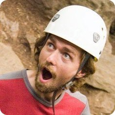

Experiential Education
----------------------

 I believe in experiential
education and fostering an appreciation for the natural world
in and outside of the classroom.  I help organize and lead
wilderness trips for disadvantaged children in Sacramento through
[Inner City Outings](http://ico.sierraclub.org/sacramento/).
I used to guide rock climbing, snow camping, and backpacking trips
for college students and the general public through Davis 
[Outdoor Adventures](http://campusrecreation.ucdavis.edu/outdoor_adventures)
and [Shasta Mountain Guides](http://www.shastaguides.com).  I was introduced
to outdoor leadership and education through Princeton's orientation
program, [Outdoor Action](http://www.princeton.edu/%7Eoa/index.shtml),
where I lead trips and trained leaders in both technical skills 
and group dynamics (see my 
[Outdoor Guide C.V.](http://www.carlboettiger.info/wp-content/uploads/2011/07/climbingcv.pdf)).
See my [Teaching page](http://carlboettiger.info/teaching.html) for more
on my teaching inside the classroom.

Nonprofit Leadership
---------------------

I believe in local community engagement and outreach. Or maybe I just
like meetings too much.  From 2008-2012 I volunteered on the board
of directors of the nonprofit Solar Community Housing Association
([SCHA](http://schadavis.org)), which is dedicated to sustainable
cooperative living. During this time I helped the all-volunteer nonprofit
bid for and execute the renovation of two historic Davis homes into a LEED
certified cooperative providing affordable housing.   The effort involved
over 200 volunteers and student interns and over $500,000 investment over
two years. In the following year we took over management of the on campus
Domes cooperative through an agreement with UC Davis, performing the
estimated $1 million in renovations through a community build involving
nearly 500 volunteers over 4 days and a $30,000 fund raising campaign.
I have also served as treasurer, webmaster, and a community mediator,
and have attended and run workshops on conflict resolution, consensus
decision making and meeting facilitation.

Open Science 
------------

I believe more open science makes large-scale, collaborative efforts
possible, increases the chances that results are reproducible and improves
the access of educators, policy-makers and taxpayers to the products
of publicly funded research. I am a founding member of the [Davis Open
Science](http://openwetware.org/wiki/UC_Davis_Open_Science) group, which
promotes awareness, tools, and community around open science issues.  
 I strive to make my research process
transparent and reproducible through the practice of [Open Notebook
Science](http://www.carlboettiger.info/2012/09/28/Welcome-to-my-lab-notebook.html)
I am particularly interested in the role of technology in hampering or
facilitating these goals.  In this spirit, I am a founding member of the
[rOpenSci Project](http://ropensci.org), a software developer collective
with the goals of providing tools and building community to promote open
science by providing programmatic access to scientific databases.

