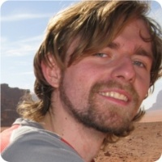

 
I began my PhD as a pencil+paper theorist.  A fortuitous training grant in Computational Science 
bolstered my high performance computing skills while my interest in stochastic systems
me to large datasets where we might hope to resolve weak signals of interesting processes. 
I have worked in a variety of areas (outlined below).  For a more up-to-date or in depth
look, why not see [what I am working on right now?](/lab-notebook.html)

Ecology
=======

Population dynamics
-------------------

* Stochastic population dynamics. See my [populationdynamics](https://github.com/cboettig/populationdynamics) research repository.
* Methods for detecting early warning signals of regime shifts. See [Boettiger and Hastings 2012a,b](/vita.html) and my [earlywarning](https://github.com/cboettig/earlywarning) research repository.  

Decision theory
---------------

* Conservation, management & control under uncertainty and severe nonlinearity. See my [pdg_control](https://github.com/cboettig/pdg_control) research repository.  
* Non-parametric methods.  See my [nonparametric-bayes](https://github.com/cboettig/nonparametric-bayes) research repository.  

Evolution
=========

Adaptive Dynamics 
-----------------

* Fluctuation domains in evolution. See [Boettiger *et al.* 2010](/vita.html) and my [fluctuationDomains](https://github.com/cboettig/fluctuationDomains) research repository.
* Waiting-time to evolutionary branching. See my [AdaptiveDynamics](https://github.com/cboettig/AdaptiveDynamics) repository.  

Compartive Phylogenetics
------------------------

* Limits to inference in phylogeny.  See [Boettiger *et al.* 2012](/vita.html) and my [pmc](https://github.com/cboettig/pmc) research repository.
* Detecting evolutionary regime shifts See [Beaulieu *et al.* 2012](/vita.html), our CRAN package ([OUwie](http://cran.r-project.org/web/packages/OUwie/index.html)), and my [wrightscape](https://github.com/cboettig/wrightscape) research repository

* programmatic access to large databases.  I'm a founding member of the [ropensci](http://ropensci.org) Project, which has more details and links to software we provide.  

- [An index of my projects on Github](software.html)
- [Outline of project workflow & data management](http://www.carlboettiger.info/2012/05/06/research-workflow.html)

I enjoy exposure to fieldwork whenever I can convince colleagues to take me along.  (I have eight+ years of experience as an alpine guide and can carry a shovel).  Though my own research has no field component, I'm thankful for recent opportunities from surveying pitfall traps for tiger salamanders to helping excavate icthysaur fossils in the Nevada desert. 

